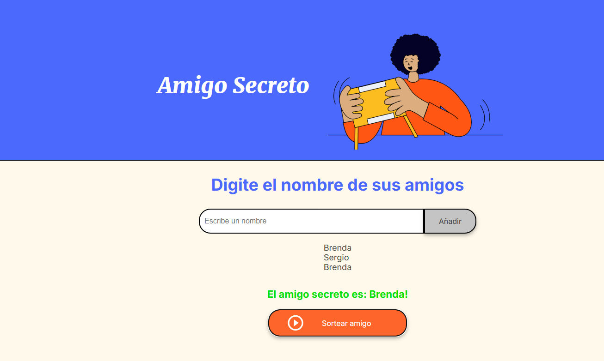
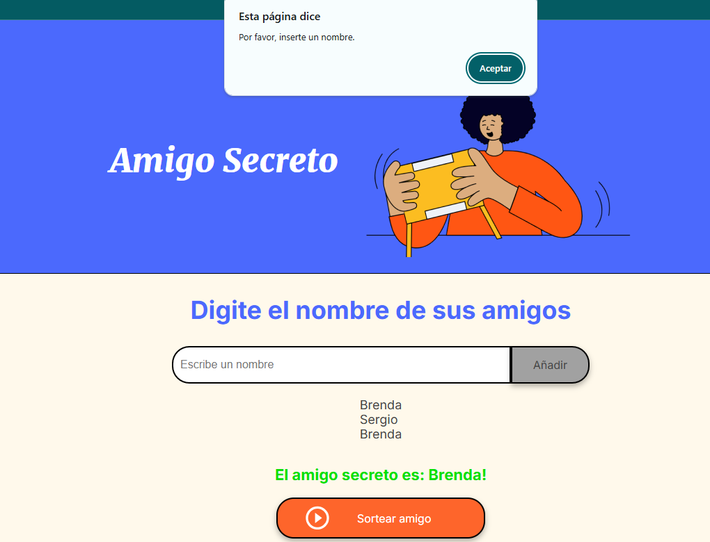

# ALURA

# 🎉 Amigo Secreto

Este es un proyecto realizado en **JavaScript, HTML y CSS**, consiste en un juego de amigo secreto

## 🚀 Funcionalidades
- **Agregar nombres**: Los usuarios pueden escribir el nombre de un amigo y agregarlo a una lista.
- **Validación de entrada**: Si el campo está vacío, se muestra una alerta pidiendo un nombre válido.
- **Visualización de la lista**: Los nombres ingresados aparecen en una lista visible.
- **Sorteo aleatorio**: Al hacer clic en el botón "Sortear Amigo", se selecciona aleatoriamente un nombre y se muestra en pantalla.

## 🛠️ Tecnologías utilizadas
- **HTML** → Estructura de la página.
- **CSS** → Diseño y estilos.
- **JavaScript** → Lógica del programa.

## 📂 Estructura del proyecto
```
📁 amigo-secreto/
├── 📄 index.html   # Página principal
├── 📄 style.css    # Estilos de la página
├── 📄 app.js       # Lógica del programa
└── 📁 assets/      # Imágenes y otros recursos
```

## 📌 Cómo ejecutar el proyecto
1. **Descargar o clonar el repositorio:**
   ```sh
   git clone https://github.com/tu-usuario/amigo-secreto.git
   ```
2. **Abrir el archivo `index.html` en el navegador.**

## 🖥️ Captura de pantalla



